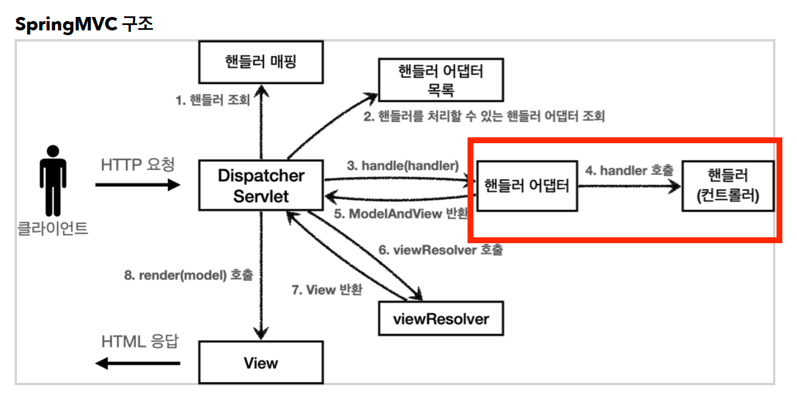

# Spring-MVC 동작원리 정리



그림과 함께 `org.springframework.web.servlet.DispatcherServlet` 의 `doDispatch()` 코드를 살펴보면서 동작원리를 정리해보자.
전반적인 내용은 김영한 선생님의 Spring MVC 1편을 참고하였습니다.
---

#### 1. 핸들러 조회
핸들러 매핑을 통해 요청 URL에 매핑된 핸들러(컨트롤러)를 조회한다.
`DispatcherServlet` 은 모든 경로(`urlPatterns="/"`)에 대해서 매핑한다.
더 자세한 경로가 우선순위가 높아서 등록한 서블릿도 함께 동작한다.
`RequestMappingHandlerMapping`은 스프링 빈 중에서
`@RequestMapping` 또는 `@Controller`가 클래스 레벨에 붙어 있는 경우에 매핑 정보로 인식한다.

````java
HandlerExecutionChain mappedHandler = null;
        
try {

    // Determine handler for the current request.
    mappedHandler = getHandler(processedRequest);
    if (mappedHandler == null) {
        noHandlerFound(processedRequest, response);
        return;
    }
````

```java
@Nullable
protected HandlerExecutionChain getHandler(HttpServletRequest request) throws Exception {
    if (this.handlerMappings != null) {
        for (HandlerMapping mapping : this.handlerMappings) {
            HandlerExecutionChain handler = mapping.getHandler(request);
            if (handler != null) {
                return handler;
            }
        }
    }
    return null;
}
```
---
#### 2. 핸들러를 처리할 수 있는 핸들러 어댑터 조회
핸들러를 실행할 수 있는 핸들러 어댑터를 조회한다.

````java
// Determine handler adapter for the current request.
HandlerAdapter ha = getHandlerAdapter(mappedHandler.getHandler());
````

스프링은 이미 필요한 핸들러 매핑과 핸들러 어댑터를 대부분 구현해두었다.
**HandlerMapping**
```
0 = RequestMappingHandlerMapping : 애노테이션 기반의 컨트롤러인 @RequestMapping 에서 사용
1 = BeanNameUrlHandlerMapping : 스프링 빈의 이름으로 핸들러를 찾는다.
```

**HandlerAdapter**
```
0 = RequestMappingHandlerAdapter : 애노테이션 기반의 컨트롤러인 @RequestMapping에서 사용
1 = HttpRequestHandlerAdapter : HttpRequestHandler 처리
2 = SimpleControllerHandlerAdapter : Controller 인터페이스 (애노테이션X, 과거에 사용) 처리
```
핸들러 매핑도, 핸들러 어댑터도 모두 순서대로 찾고 만약 없으면 다음 순서로 넘어간다.

---

#### 3. 어댑터에게 핸들러 위임

#### 4. 핸들러 호출
````java
// Actually invoke the handler.
mv = ha.handle(processedRequest, response, mappedHandler.getHandler());
````
#### 4-1. `ArgumentResolver` 호출
애노테이션 기반의 컨트롤러는 매우 다양한 파라미터를 사용할 수 있다.
`HttpServletRequest`, `Model`은 물론이고,
`@RequestParam` `@ModelAttribute` 같은 애노테이션 그리고
`@RequestBody`, `HttpEntity` 같은 HTTP 메시지를 처리하는 부분까지
매우 큰 유연함을 보여주었다.

`Adapter`는 `ArgumentResolver`를 호출해서 컨트롤러(핸들러)가 필요로 하는 다양한 파라미터의 값(객체)을 생성한다.
이 때, 메시지 바디를 값(객체, 문자, HttpEntity 등) 으로 변환할 때 HTTP 메시지 컨버터가 사용된다.
파라미터의 값이 모두 준비되면 컨트롤러를 호출하면서 값을 넘겨준다.


예를 들어보자.
```
content-type: application/json
@RequestMapping
void hello(@RequestBody String data) {}
```
content-type = Json, 클래스 타입 = String

RequestBody 처리 아규먼트 리졸버 : 요청 바디는 json인데, String 으로 받길 원하네.
스트링 메시지 컨버터로 Json 형태의 데이터를 String 으로 바꿔 파라미터로 넘겨주자.

```
content-type: application/json
@RequestMapping
void hello(@RequestBody HelloData data) {}
```
content-type = Json, 클래스 타입 = 객체

아규먼트 리졸버 : 요청 바디는 json인데, 객체로 받길 원하네. 잭슨 메시지 컨버터를 사용해
요청 바디(Json)를 객체로 변환해 파라미터로 넘겨주자.

#### 4-2. 컨트롤러 실행
비즈니스 로직을 수행하고 응답값을 반환

#### 4-3. `ReturnValueHandler` 호출
`HandlerMethodReturnValueHandler`를 줄여서 `ReturnValueHandler`라 부른다.
`ArgumentResolver`와 비슷한데, 이것은 응답 값을 변환하고 처리한다.
컨트롤러에서 `String`으로 뷰 이름을 반환해도, 동작하는 이유가 바로 `ReturnValueHandler` 덕분이다.
스프링은 10여개가 넘는 `ReturnValueHandler`를 지원한다.
예) `ModelAndView`, `ResponseBody`, `HttpEntity`, `String`

예를 들어보자.

```
accept : application / json
@ResponseBody
HelloData hello() {}
```
`ReturnValueHandler` : 클라이언트가 json 으로 받길 원하네. 컨트롤러의 반환형이 객체구나. 잭슨 메시지 컨버터를 써서
객체를 json 으로 바꿔서 응답 body에 담도록하자.

`@ResponseBody` 또는 `HttpEntity` 타입을 반환하는 경우라면 HTTP 메시지 Body에
데이터를 담고 View Rendering 작업이 필요가 없다. 따라서 `6~8` 과정은 건너뛴다.

---

#### 5. ModelAndView 반환
핸들러 어댑터는 핸들러가 반환하는 정보를 `ModelAndView`로 변환해서 반환한다.

---

#### 6. ViewResolver 호출
뷰 리졸버를 찾고 실행한다. 예를 들어 JSP의 경우 `InternalResourceViewResolver`가 실행된다.
`InternalResourceViewResolver`는 스프링부트가 자동으로 등록하는 `ViewResolver`이다.

**스프링 부트가 자동 등록하는 뷰 리졸버**
```
1 = BeanNameViewResolver : 빈 이름으로 뷰를 찾아서 반환한다. (예: 엑셀 파일 생성 기능에 사용)
2 = InternalResourceViewResolver : JSP를 처리할 수 있는 뷰를 반환한다.
```
---

#### 7. View 반환
뷰 리졸버는 뷰의 논리 이름을 물리 이름으로 바꾸고, 렌더링 역할을 담당하는 뷰 객체를 반환한다.
`InternalResourceViewResolver` 는 `application.properties`에 등록한
`spring.mvc.view.prefix`, `spring.mvc.view.suffix` 설정 정보를 사용해서
뷰의 논리 이름을 물리 이름으로 바꾼다.

```java
View view;
String viewName = mv.getViewName();
view = resolveViewName(viewName, mv.getModelInternal(), locale, request);
```
---

#### 8. render(model) 호출
뷰를 통해서 뷰를 렌더링한다.
JSP의 경우 뷰 리졸버가 `InternalResourceView(JstlView)` 를 반환하는데,
내부에 `forward()`로직이 있다.
 
```java
view.render(mv.getModelInternal(), request, response);
```
---
#### 9. HTML 응답이 전송되며 종료

#### 참고링크
- [메시지 컨버터란](https://velog.io/@kiwonkim/MVC1-HTTP-메시지-컨버터)
- [@ResponseBody 실행 흐름](https://www.inflearn.com/questions/422763/responsebody인-경우의-실행흐름이-궁금합니다)
