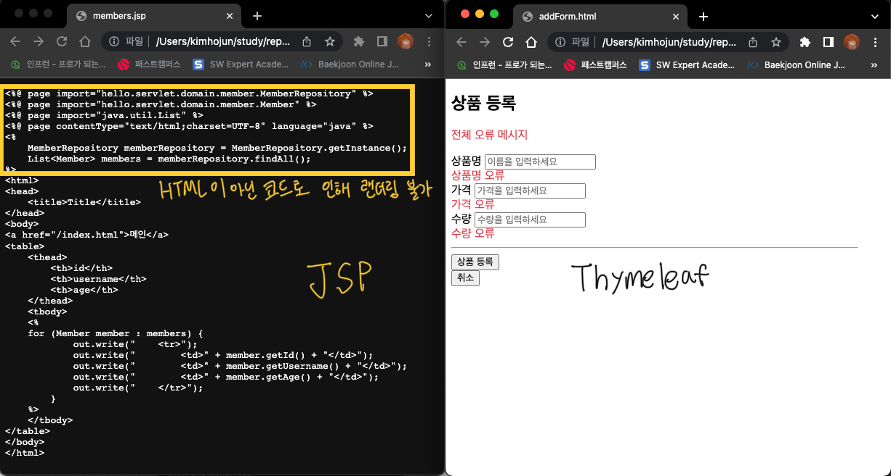

# Thymeleaf 기능 정리

타임리프의 주요 기능을 정리했습니다.
전반적인 내용은 김영한 선생님의 Spring MVC 2편을 참고하였습니다.
---

## 목차
- [타임리프 특징](#타임리프-특징)
- [텍스트 출력](#텍스트-출력)
- [Spring EL](#Spring-EL)
- [객체](#객체)
- [URL 링크](#URL-링크)
- [리터럴](#리터럴)
- [연산](#연산)
- [속성 값 설정](#속상-값-설정)
- [반복](#반복)
- [블록](#블록)
- [자바스크립트 인라인](#자바스크립트-인라인)
- [템플릿 조각](#템플릿-조각)
- [템플릿 레이아웃](#템플릿-레이아웃)
- [입력 폼 처리](#입력-폼-처리)
- [검증 오류 처리](#검증-오류-처리)
- [참고링크](#참고링크)
---


## 타임리프 특징
**서버 사이드 HTML 렌더링**
> 타임리프는 벡엔드 서버에서 HTML을 동적으로 렌더링 하는 용도로 사용된다.

**네츄럴 템플릿**
> 타임리프로 작성한 파일은 HTML을 유지한다. 웹 브라우저에서 파일을 직접 열어도
> 내용을 확인할 수 있고, 서버를 통해 뷰 템플릿을 거치면 동적으로 변경된 결과를 확인할 수 있다.


**스프링 통합 지원**
> 타임리프는 스프링과 자연스럽게 통합되고, 스피링의 다양한 기능을 편리하게 사용할 수 있게 지원한다.
> (입력 폼 처리 섹션 참고)
---


## 텍스트 출력
타임리프는 기본적으로 HTML 태그의 속성에 기능을 정의해서 사용한다.

**태그 속성 안에서 데이터 출력하기**
```html
<span th:text="${data}"></span>
```

**태그 속성 밖에서 데이터 출력하기**
```html
[[${data}]]
```

타임리프의 `th:text`는 HTML에서 사용하는 특수 문자를 HTML 엔티티로 변경한다(=이스케이프).
공백 같은 경우는 이스케이프 처리되지 않는 걸 보니, 모든 HTML 요소를 이스케이프 처리하는 건 아닌가 보다.
- `<` → `&lt;`
- `>` → `&gt;`
- `&` → `&amp;`
- `'` → `&pos;`
- `"` → `&quot;`
- `공백` → `&nbsp;`
- [더 많은 HTML 엔티티를 확인하고 싶다면 참고](https://www.w3.org/TR/html4/sgml/entities.html)

**태그 속성 안에서 데이터 출력하기 (이스케이프 처리 X)**
```html
<span th:utext="${data}"></span>
```

**태그 속성 밖에서 데이터 출력하기**
```html
[(${data})]
```
---


## Spring EL
스프링이 제공하는 변수 표현식

**Object 변수 접근**
```html
<span th:text="${user.username}">
<span th:text="${user['username']}">
<span th:text="${user.getUsername()}">
```

**List 변수 접근**
```html
<span th:text="${users[0].username}">
<span th:text="${users[0]'username']}">
<span th:text="${users[0].getUsername()}">
```

**Map 변수 접근**
```html
<span th:text="${userMap['userA'].username}">
<span th:text="${userMap['userA']['username']}">
<span th:text="${userMap['userA'].getUsername()}">
```
---


## 객체
타임리프는 다양한 객체를 제공한다.

**Base Object**
```html
${#ctx.locale}
${#ctx.variableNames}
${#ctx.request}
${#ctx.response}
${#ctx.session}
${#ctx.servletContext}
```

**request/session/application Attribute**
```html
<!-- request Parameter, session/application Attribute 에 바로 접근 -->
<!-- String[] 형태 -->
${param.foo} <!-- 이름이 foo 인 파라미터를 조회-->
${param.size}
${param.isEmpty()}
${param.containsKey('foo')}

${session.foo}
${session.size()}
${session.isEmpty()}
${session.containsKey('foo')}

${application.foo}
${application.size()}
${application.isEmpty()}
${application.containsKey('foo')}
```

**Web context object**
- `${#servletContext}`
- `${#request}`
- `${#response}`
- `${#session}`
- `${#locale}`

**그외**
- `@{스프링빈 이름}`
- [유틸리티 객체](https://www.thymeleaf.org/doc/tutorials/3.0/usingthymeleaf.html#appendix-b-expression-utility-objects): 문자, 숫자, 날짜, 등을 편리하게 다루는 객체들을 제공
---


## URL 링크
타임리프에서 URL을 생성할 때는 `@{...}` 문법을 사용하면 된다.
```html
<!-- Will produce '/gtvg/order/details?orderId=3' (plus rewriting) -->
<a href="details.html" th:href="@{/order/details(orderId=${o.id})}">view</a>

<!-- Will produce '/gtvg/order/3/details' (plus rewriting) -->
<a href="details.html" th:href="@{/order/{orderId}/details(orderId=${o.id})}">view</a>

<!-- Will produce '/hello/data1?param2=data2' -->
<a th:href="@{/hello/{param1}(param1=${param1}, param2=$ {param2})}">View</a>
```
---


## 리터럴
**문자리터럴**

타임리프에서 문자 리터럴은 항상 `'`(작은 따옴표)로 감싸야 한다. (단, 공백없이 쭉 이어진다면 생략 가능)
```html
<p>Now you are looking at a <span th:text="'web application'">template file</span></p>
```
`"web application"`  → 만약 작은 따옴표를 없애면 동작하지 않는다.

**리터럴 대체**

리터럴과 변수를 혼합하여 사용하는 경우 `...` + `${data}` 를 `|...${data}|`로 대체할 수 있다.
```html
<span th:text="'hello ' + ${data}"></span>
<!-- 리터럴 대체 문법 -->
<span th:text="|hello ${data}|"></span>
```
---


## 연산
몇몇 연산은 자바의 문법과 동일하다.
- `+`
- `-`
- `*`
- `/`
- `%`

비교 연산은 HTML 엔티티를 사용해야 한다.
- `>` (gt)
- `<` (lt)
- `>=` (ge)
- `<=` (le)
- `!` (not)
- `==` (eq)
- `!=` (ne)

조건 표현식 사용이 가능하다.
```html
<li>(10 % 2 == 0)? '짝수':'홀수' = <span th:text="(10 % 2 == 0)? '짝수':'홀수'"></span></li>
```

엘비스 연산자를 사용하면 조건 표현식을 축약할 수 있다.
```html
<div th:object="${session.user}">
    <!-- data가 있으면 data를, 없으면 '데이터가 없습니다.' 출력 -->
    <span th:text="${data}?: '데이터가 없습니다.'"></span>
</div>
```
---

## 속성 값 설정

**속성 설정**

`th:*` 속성을 지정하면 타임리프는 기존 속성을 `th:*`로 지정한 속성으로 대체한다.
기존 속성이 없다면 새로 만든다.
```html
<!-- 랜더링 전 -->
<input type="text" name="mock" th:name="userA" />
<!-- 랜더링 후 -->
<input type="text" name="mock" name="userA" />
```

**속성 추가**

```html
<!-- 랜더링 이전 -->
<input type="text" class="text" th:attrappend="class='large'" />
<input type="text" class="text" th:attrprepend="class='large'" />
<input type="text" class="text" th:classappend="class='large'" />
<!-- 랜더링 이후 -->
<input type="text" class="text large" />
<input type="text" class="large text" />
<input type="text" class="text large" />
```

**checked 처리**

HTML에서는 `checked="false"`
경우에도 `checked` 속성이 있기 때문에 체크 처리가 되어버린다.
타임리프는 `th:checked="true/false"`를 사용하면 간편하게 체크 처리를 할 수 있다.
```html
<!-- 랜더링 이전 -->
<input type="checkbox" th:checked="false" />
<input type="checkbox" th:checked="true" />
<!-- 랜더링 이후 -->
<input type="checkbox" />
<input type="checkbox" checked />
```
---

## 반복

**반복 기능**

`java.util.Iterable` , `java.util.Enumeration` 을 구현한 모든
객체를 반복에 사용할 수 있다. `Map` 도 사용할 수 있는데, 이 경우 변수에 담기는 값은 `Map.Entry` 이다.

```html
<table>
    <tr th:each="user, userStat : ${users}">
        <td th:text="${userStat.count}"></td>
        <td th:text="${userStat.index}"></td>
        <td th:text="${userStat.size}"></td>
        <td th:text="${userStat.even}"></td>
        <td th:text="${userStat.odd}"></td>
        <td th:text="${userStat.first}"></td>
        <td th:text="${userStat.last}"></td>
        <td th:text="${userStat.current}"></td>
        <td th:text="${user.username}"></td>
        <td th:text="${user.age}"></td>
    </tr>
</table>
```

**반복 상태**

`<tr th:each="user, userStat : ${users}">`
반복의 두번째 파라미터를 설정해서 반복의 상태를 확인할 수 있다.
두 번째 파라미터는 생략 가능한데, 파라미터명은 지정한 변수명 + stat 이 된다.
- index : 0부터 시작하는 값
- count : 1부터 시작하는 값
- size : 전체 사이즈
- even , odd : 홀수, 짝수 여부( boolean )
- first , last :처음, 마지막 여부( boolean )
- current : 현재 객체
---

## 블록

`th:block`은 HTML 태그가 아닌 타임리프의 유일한 자체 태그이다. 하나 이상의 <tr>이 필요한 테이블을 만들 때 유용합니다.

```html
<th:block th:each="user : ${users}">
    <div>
        사용자 이름1 <span th:text="${user.username}"></span>
        사용자 나이1 <span th:text="${user.age}"></span>
    </div>
    <div>
        요약 <span th:text="${user.username} + ' / ' + ${user.age}"></span>
    </div>
</th:block>
```
---

## 자바스크립트 인라인

## 템플릿 조각
## 템플릿 레이아웃
## 입력 폼 처리
## 검증 오류 처리
타임리프를 활용하면 편리하게 검증 오류를 표현할 수 있다.
- `#fields`: `#fields`로 `BindingResult`가 보관된 검증 오류에 접근할 수 있다.
- `th:errors="*{...}"`: 해당 필드에 오류가 있는 경우 태그를 출력한다. `MessageCodesResolver`에 의해 생성된 오류 메시지 코드를 순서대로 돌아가면서 메시지를 찾아 text 로 출력한다. 
- `th:errorclass`: `th:field`에서 지정한 필드에 오류가 있으면 `class` 정보를 추가한다.
- `th:field="*{...}"`: 정상 상황에는 모델 객체의 값을 사용하지만, 오류가 발생하면 `FieldError` 에서 보관한 값을 사용해서 값을 출력한다.

컨트롤러
```java
class ValidationController {
  @PostMapping("/add")
  public String addItemV3(@ModelAttribute Item item, BindingResult bindingResult) {
      if (가격범위오류) {
          bindingResult.addError(new FieldError("item", "price", item.getPrice(), false,
                  new String[]{"range.item.price"},
                  new Object[]{1000, 1000000}, null));
      }
  }

  /**
   * src/main/resources/errors.properties
   * range.item.price=가격은 {0} ~ {1} 까지 허용합니다.
   */
}
```

HTML 페이지
```html
<!-- #fields로 bindingResult 접근 -->
<div th:if="${#fields.hasGlobalErrors()}">
  <p class="field-error" th:each="err : ${#fields.globalErrors()}"
     th:text="${err}">글로벌 오류 메시지</p>
</div>

<!-- th:errorclass 활용 예시-->
<input type="text"
       id="price"
       th:field="*{price}"
       class="form-control"
       th:errorclass="field-error"
       placeholder="가격을 입력하세요">

<!-- th:errors 예시 -->
<div class="field-error" th:errors="*{price}">
  가격 오류
</div>
```


## 참고링크
- [스프링 MVC 2편 - 백엔드 웹 개발 활용 기술](https://www.inflearn.com/course/스프링-mvc-2/dashboard)
- [타임리프 공식 메뉴얼 - 기본기능](https://www.thymeleaf.org/doc/tutorials/3.0/usingthymeleaf.html)
- [타임리프 공식 메뉴얼 - 스프링 통합](https://www.thymeleaf.org/doc/tutorials/3.0/thymeleafspring.html)