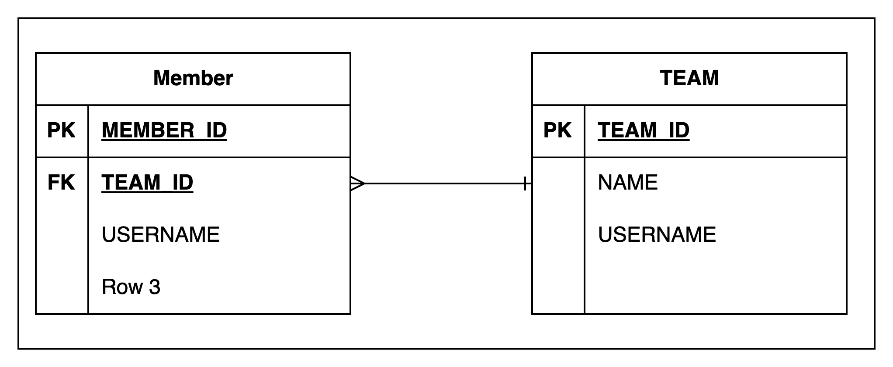

# 실습 테이블 설계


## 연관관계 매핑이 필요한 이유
연관관계 매핑이 필요한 이유를 알아보자.

- 다음은 위 ERD에서 ORDER 테이블을 Entity로 작성한 예이다.
- 연관관계 매핑을 하기 전이다.
```java
@Entity
@Table(name = "ORDERS")
public class Order {

    @Id
    @GeneratedValue
    @Column(name = "ORDER_ID")
    private Long id;

    @Column(name = "MEMBER_ID")
    private Long memberId;
    private LocalDateTime orderDate;

    @Enumerated(EnumType.STRING)
    private OrderStatus status;
}
```
### 문제점
- `Member` 클래스 참조변수를 갖고있지 않고, `memberId` 를 갖고 있다.
- 현재 상황에서 orderId가 주어졌을 때, 주문자를 얻는 방법은 다음과 같다:
```java
Long orderId = 1L;
Order order = em.find(Order.class, orderId);
Long memberId = order.getMemberId();
Member member = em.find(Member.class, memberId);
```
- 우리가 바라는 것은 다음 코드처럼 객체지향스럽게 주문자를 얻고 싶다.
- 연관 관계 매핑을 통해 가능하다.
```java
Long orderId = 1L;
Order order = em.find(Order.class, orderId);
Member member = order.getMember();
```

## 단방향 연관관계
다음과 같은 테이블이 있다고 가정하고 객체를 테이블에 맞추어 모델링해보자.


```java
@Entity
public class Member {
    @Id
    @GeneratedValue
    @Column(name = "MEMBER_ID")
    private Long id;

    @Column(name = "USERNAME")
    private String username;

    @Column(name = "TEAM_ID") // 외래키
    private Long teamId;
}
```
Member 클래스는 외래키 식별자 `teamId`를 직접 다룬다.

```java
@Entity
public class Team {
    @Id
    @GeneratedValue
    @Column(name = "TEAM_ID")
    private Long id;
    private String name;
}
```

Member, Team 객체를 만드는 예제 코드이다.
```java
Team team = new Team();
team.setName("TeamA");
em.persist(team);

Member member = new Member();
member.setUsername("member1");
member.setTeamId(team.getId()); // 객체지향스럽지 않음 -> 변경:member.setTeam(team)
em.persist(member);

tx.commit();
```
member 객체의 Team을 설정하는 로직이 객체지향스럽지 않다.

member 객체의 Team을 조회하는 예제 코드이다.

```java
Long teamId = member.getTeamId(); // Member의 Team을 찾을때마다 member.getTeamId()를 호출해야한다.
Team findTeam = em.find(Team.class, teamId); // 객체지향 스럽지 않음 -> 변경:member.getTeam();
```
- member 객체의 Team을 조회하는 로직이 객체지향스럽지 않다.
- 테이블은 외래 키로 조인을 사용해서 연관된 테이블을 찾는다.
- 객체는 참조를 사용해서 연관된 객체를 찾는다.
- 테이블과 객체 사이에는 큰 간격이 있다.

단방향 매핑을 통해 수정해보자.

```java
@Entity
public class Member {
    @Id
    @GeneratedValue
    @Column(name = "MEMBER_ID")
    private Long id;

    @Column(name = "USERNAME")
    private String username;
    
    // Member가 N이다.
    @ManyToOne
    @JoinColumn(name = "TEAM_ID")
    private Team team;
}
```

이제 Member, Team 클래스를 다음과 같은 방법으로 사용할 수 있다.
```java
// Member 객체의 Team 설정 코드
Team team = new Team();
team.setName("TeamA");
em.persist(team);

Member member = new Member();
member.setUsername("member1");
member.setTeam(team);

// Member 객체의 Team 조회 코드
Member findMember = em.find(Member.class, member.getId());
Team findTeam = findMember.getTeam();
```

위 코드를 수행하면 다음과 같은 쿼리가 수행된다.


# Reference
- 자바 ORM 표준 JPA 프로그래밍, 김영한 지음
